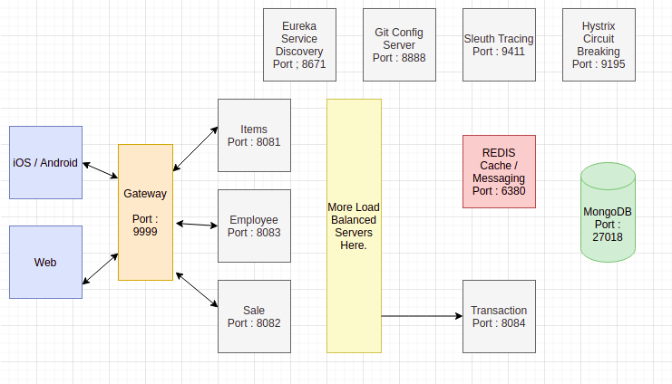

# SUPERMARKET SYSTEM DESIGN PROJECT

A Supermarket built from scratch as a long term system design project. A resilient Microservice based architecture complete with :
- REST API
 - API Gateway
   - Load Balacing
    - Request Filtering
    - Rate Limiting
 - Service Discovery
 - Circuit Breaker
 - Caching
 - Messaging
 - Request Tracing
 - Event Driven operations
 - Batch Jobs
 - NoSQL Database (MongoDB)
- JWT Two Factor Based Authentication
 - Configuration Server

## Meta

James Hart – Hart87@gmail.com

Distributed under the Apache license. See ``LICENSE`` for more information.

[https://github.com/hart87/supermarket](https://github.com/hart87/supermarket)

## Contributing

1. Please submit any pull requests on either the branch containing the feature you want to add onto or master. If you add a feature, please submit it with a passing test. 